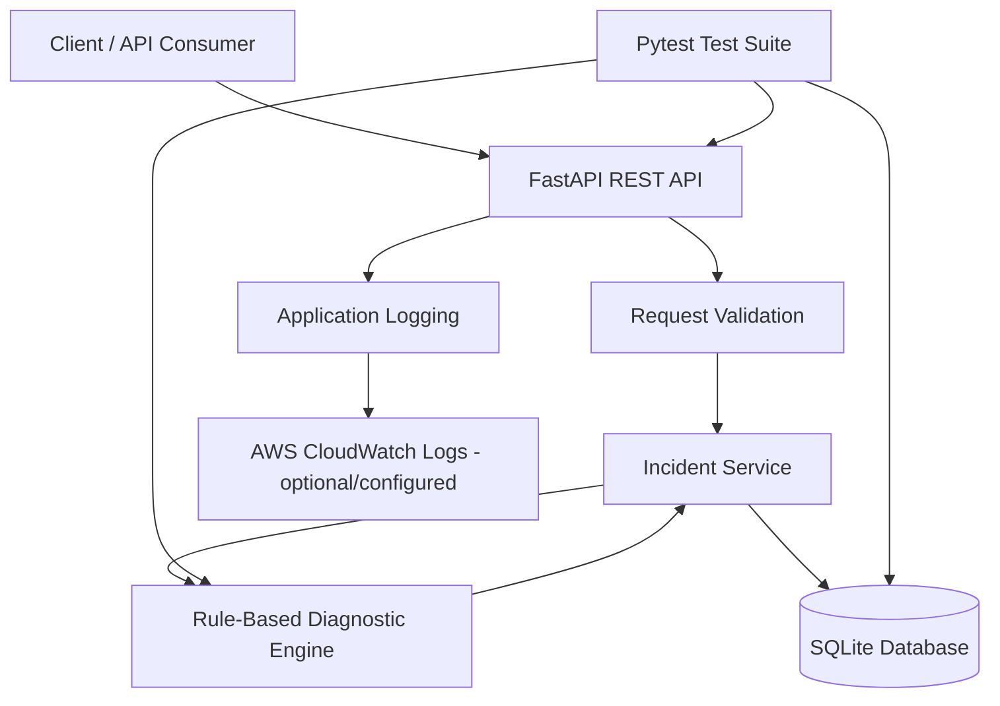

# Architecture Diagram

```mermaid
flowchart TD
    A[Client / API Consumer] --> B[FastAPI REST API]
    B --> C[Request Validation]
    C --> D[Incident Service]
    D --> E[Rule-Based Diagnostic Engine]
    D --> F[(SQLite Database)]
    E --> D
    B --> G[Application Logging]
    G --> H[AWS CloudWatch Logs - optional/configured]
    I[Pytest Test Suite] --> B
    I --> E
    I --> F
```

The diagram is a proposed architecture based on the described stack. Confirm it against the actual code before presenting it as implemented.
